# C4 Container Diagram (C2)

This diagram zooms into Invowk to show its internal containers - the major applications, components, and data stores that make up the system.

> **Note**: In C4 terminology, "container" refers to a separately runnable/deployable unit (not Docker containers). Since Invowk is a single CLI binary, we show the major internal components as logical containers.

## Diagram

```mermaid
C4Container
    title Container Diagram - Invowk

    Person(user, "User", "Developer or team member")

    System_Ext(docker, "Docker/Podman", "Container engine")
    System_Ext(git, "Git Repositories", "Remote modules")
    System_Ext(host_shell, "Host Shell", "bash/sh/PowerShell")

    Container_Boundary(invowk_cli, "Invowk CLI") {
        Container(cmd, "CLI Commands", "Go/Cobra", "Root, cmd, init, config, module, tui, completion subcommands")
        Container(discovery, "Discovery Engine", "Go", "Locates invkfiles and modules with precedence ordering")
        Container(config, "Configuration Manager", "Go/Viper+CUE", "Loads and validates user configuration")

        Container(runtime_native, "Native Runtime", "Go", "Executes via host shell (bash/sh/PowerShell)")
        Container(runtime_virtual, "Virtual Runtime", "Go/mvdan-sh", "Embedded shell interpreter with u-root builtins")
        Container(runtime_container, "Container Runtime", "Go", "Executes inside Docker/Podman containers")

        Container(container_engine, "Container Engine Abstraction", "Go", "Unified Docker/Podman interface with auto-fallback")
        Container(provision, "Image Provisioner", "Go", "Creates ephemeral layers with invowk binary and modules")

        Container(ssh_server, "SSH Server", "Go/Wish", "Enables container-to-host callbacks via SSH tunneling")
        Container(tui_server, "TUI Server", "Go/Bubble Tea", "HTTP server for TUI requests from child processes")

        Container(cue_parser, "CUE Parser", "Go/cuelang", "3-step parsing: compile schema, unify data, decode")
        Container(module_resolver, "Module Resolver", "Go", "Git-based dependency resolution with caching and lock files")
    }

    ContainerDb(config_file, "Config File", "CUE", "~/.config/invowk/config.cue")
    ContainerDb(invkfiles, "Invkfiles", "CUE", "invkfile.cue command definitions")
    ContainerDb(modules, "Modules", "Directories", "*.invkmod directories with invkmod.cue + invkfile.cue")
    ContainerDb(cache, "Module Cache", "Filesystem", "~/.cache/invowk/modules/")

    Rel(user, cmd, "Runs commands", "CLI")

    Rel(cmd, discovery, "Discovers commands")
    Rel(cmd, config, "Loads configuration")

    Rel(discovery, cue_parser, "Parses invkfiles/invkmods")
    Rel(discovery, invkfiles, "Reads", "File I/O")
    Rel(discovery, modules, "Reads", "File I/O")

    Rel(config, cue_parser, "Parses config")
    Rel(config, config_file, "Reads", "File I/O")

    Rel(cmd, runtime_native, "Executes native commands")
    Rel(cmd, runtime_virtual, "Executes virtual commands")
    Rel(cmd, runtime_container, "Executes container commands")

    Rel(runtime_native, host_shell, "Spawns shell", "exec")
    Rel(runtime_virtual, tui_server, "Requests TUI", "HTTP")

    Rel(runtime_container, container_engine, "Runs containers")
    Rel(runtime_container, provision, "Provisions images")
    Rel(runtime_container, ssh_server, "Starts for callbacks")
    Rel(runtime_container, tui_server, "Requests TUI", "HTTP")

    Rel(container_engine, docker, "Executes", "CLI/API")
    Rel(provision, container_engine, "Builds images")

    Rel(module_resolver, git, "Fetches", "Git protocol")
    Rel(module_resolver, cache, "Caches modules", "File I/O")
    Rel(discovery, module_resolver, "Resolves dependencies")
```

## Internal Components

### Entry Points

| Component | Technology | Responsibility |
|-----------|------------|----------------|
| **CLI Commands** | Go/Cobra | Entry points for all user interactions: `cmd`, `init`, `config`, `module`, `tui`, `completion` subcommands |

### Core Engine

| Component | Technology | Responsibility |
|-----------|------------|----------------|
| **Discovery Engine** | Go | Finds `invkfile.cue` and `*.invkmod` directories with precedence ordering. Builds unified command tree. |
| **Configuration Manager** | Go/Viper+CUE | Loads config from `~/.config/invowk/config.cue`. Validates against CUE schema. |
| **CUE Parser** | Go/cuelang | Implements 3-step parsing: compile schema → unify with data → decode to Go structs. Provides rich error messages. |
| **Module Resolver** | Go | Resolves Git-based dependencies. Manages cache at `~/.cache/invowk/modules/`. Handles lock files for reproducibility. |

### Runtimes

| Component | Technology | Responsibility |
|-----------|------------|----------------|
| **Native Runtime** | Go | Executes commands via host shell (`bash`/`sh` on Unix, `PowerShell` on Windows). Fastest option. |
| **Virtual Runtime** | Go/mvdan-sh | Embedded POSIX shell interpreter. Includes u-root builtins for portability. No host shell dependency. |
| **Container Runtime** | Go | Executes commands inside Docker/Podman containers. Provides isolation and reproducibility. |

### Container Infrastructure

| Component | Technology | Responsibility |
|-----------|------------|----------------|
| **Container Engine Abstraction** | Go | Unified interface for Docker and Podman. Auto-detects available engine with fallback. |
| **Image Provisioner** | Go | Creates ephemeral image layers containing invowk binary and required modules. Enables seamless container execution. |

### Servers

| Component | Technology | Responsibility |
|-----------|------------|----------------|
| **SSH Server** | Go/Wish | Token-based SSH server for container-to-host callbacks. Enables `enable_host_ssh` feature. |
| **TUI Server** | Go/Bubble Tea | HTTP server handling TUI component requests from child processes. Enables interactive prompts in any runtime. |

## Data Stores

| Store | Format | Location | Purpose |
|-------|--------|----------|---------|
| **Config File** | CUE | `~/.config/invowk/config.cue` | User preferences: container engine, search paths, etc. |
| **Invkfiles** | CUE | `./invkfile.cue`, search paths | Command definitions with implementations |
| **Modules** | Directories | `*.invkmod/` | Packaged commands with `invkmod.cue` metadata |
| **Module Cache** | Filesystem | `~/.cache/invowk/modules/` | Cached Git-fetched remote modules |

## Component Interactions

### Command Execution Flow

1. User invokes `invowk cmd <name>`
2. **CLI Commands** receives request
3. **Discovery Engine** finds all available commands
4. **CUE Parser** parses `invkfile.cue` and module files
5. Command is matched, runtime is selected
6. Appropriate **Runtime** executes the command
7. For containers: **Image Provisioner** prepares the environment

### Configuration Loading

1. **Configuration Manager** checks for config file
2. **CUE Parser** validates against schema
3. Config values influence runtime selection and behavior

### Module Resolution

1. **Discovery Engine** finds module requirements
2. **Module Resolver** checks cache, fetches from Git if needed
3. Dependencies are resolved transitively
4. Commands from required modules become available

## Design Rationale

### Why Three Runtimes?

| Runtime | Use Case | Trade-off |
|---------|----------|-----------|
| Native | Speed, full shell features | Platform-dependent |
| Virtual | Portability, no shell dependency | Limited shell features |
| Container | Isolation, reproducibility | Overhead, Linux only |

### Why Separate Servers?

- **SSH Server**: Enables commands inside containers to call back to the host (e.g., for secrets management)
- **TUI Server**: Allows any subprocess (native, virtual, container) to request interactive UI components

### Why CUE for Configuration?

- Schema validation built-in
- Type checking before runtime
- Composable configurations
- Better error messages than YAML/JSON

## Related Diagrams

- [C4 Context Diagram (C1)](./c4-context.md) - System boundaries and external actors
- [Command Execution Sequence](./sequence-execution.md) - Temporal flow of command execution
- [Runtime Selection Flowchart](./flowchart-runtime-selection.md) - How runtimes are chosen
- [Discovery Precedence Flowchart](./flowchart-discovery.md) - How commands are discovered
