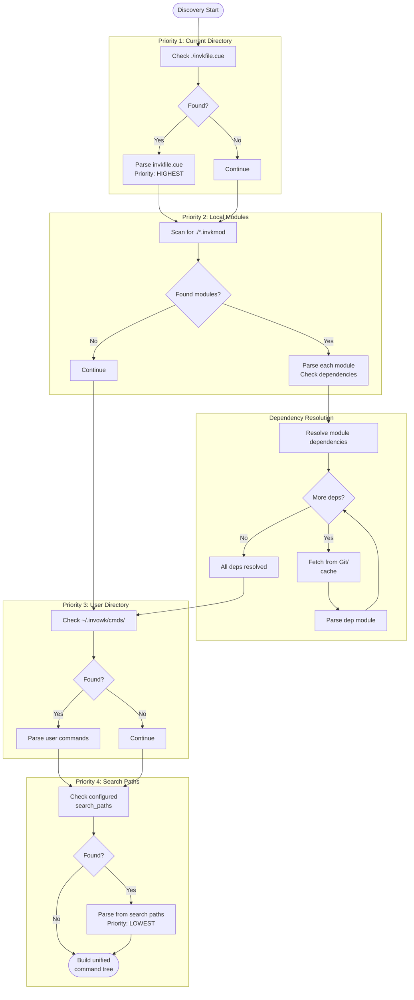
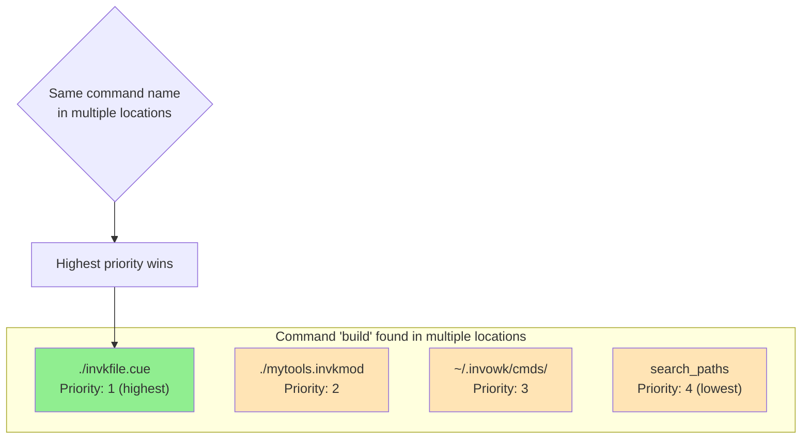
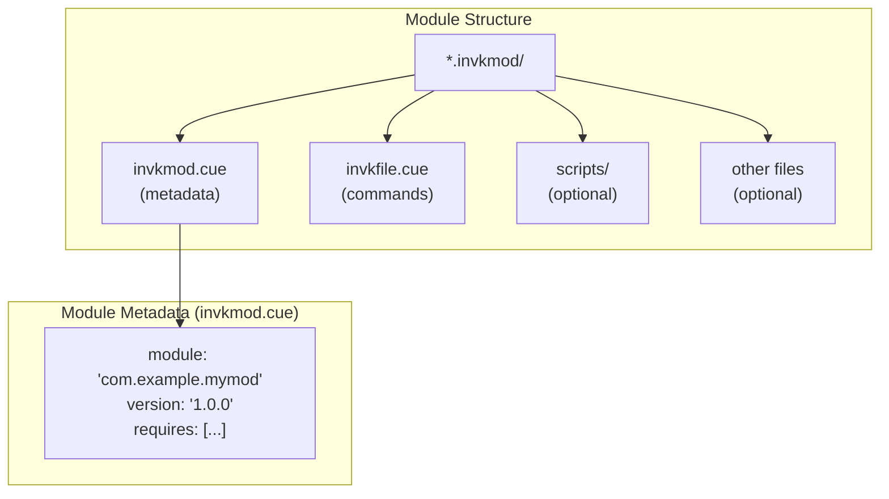
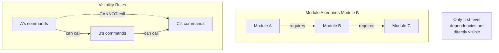
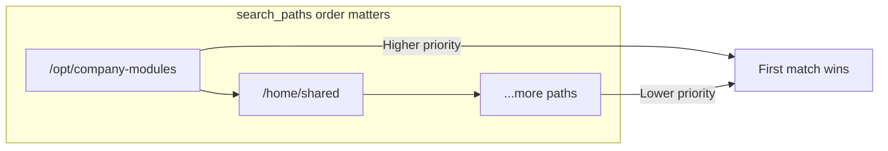
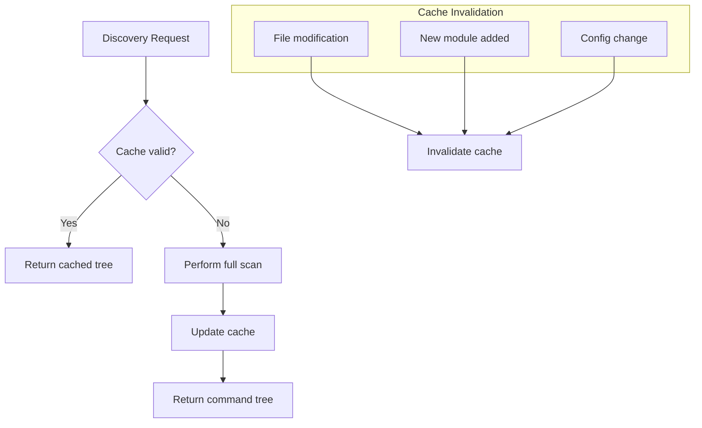
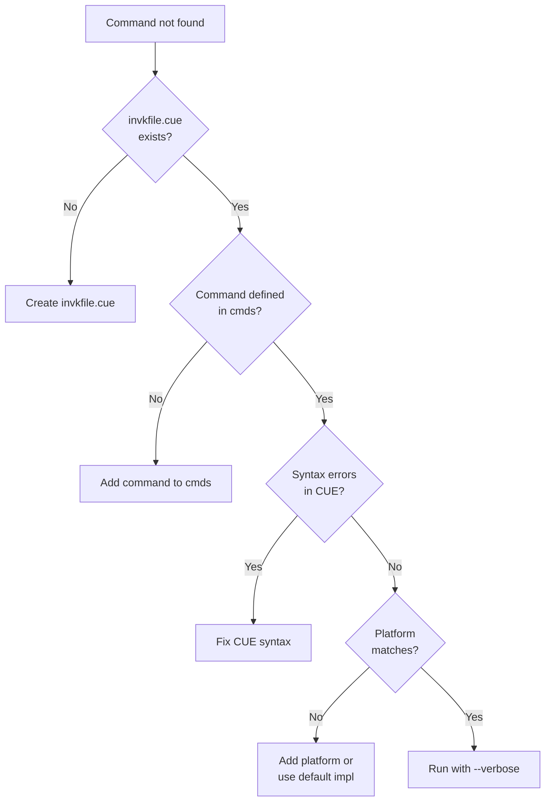
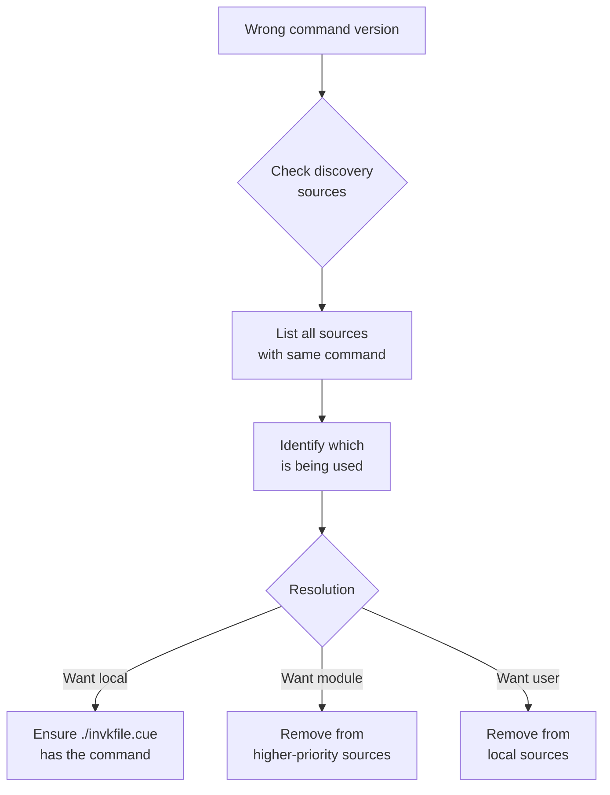

# Discovery Precedence Flowchart

This diagram shows how commands are discovered and how conflicts are resolved when the same command name appears in multiple locations.

## Discovery Flow



## Conflict Resolution

When the same command name exists in multiple locations:



### Resolution Rules

| Priority | Source | Example Path |
|----------|--------|--------------|
| 1 (highest) | Current directory invkfile | `./invkfile.cue` |
| 2 | Local modules | `./mytools.invkmod/` |
| 3 | User directory | `~/.invowk/cmds/invkfile.cue` |
| 4 (lowest) | Search paths | `/opt/invowk-modules/` |

**Key principle**: Closer to the working directory = higher priority.

## Module Discovery Details



### Required Module Fields

```cue
// invkmod.cue
module: "com.example.mymodule"  // RDNS naming convention
version: "1.0.0"                // Semantic version

// Optional
description: "My useful module"
requires: [
    {
        git: "https://github.com/org/repo.git"
        version: "v1.0.0"
    }
]
```

## Dependency Resolution



### Transitive Dependency Visibility

| From | Can Access | Cannot Access |
|------|------------|---------------|
| Module A | A's commands, B's commands | C's commands (transitive) |
| Module B | B's commands, C's commands | - |
| Root invkfile | Own commands, direct deps | Transitive deps |

**Why this restriction?**
- Prevents implicit coupling to transitive dependencies
- Makes dependencies explicit in each module
- Enables dependency upgrades without breaking consumers

## Search Path Configuration

Search paths are configured in `~/.config/invowk/config.cue`:

```cue
search_paths: [
    "/opt/company-invowk-modules",
    "/home/shared/invowk",
]
```

### Path Resolution Order



## Discovery Caching



## Common Discovery Issues

### Problem: Command Not Found



### Problem: Wrong Command Version



## Debug Commands

```bash
# List all discovered commands with sources
invowk cmd --list --verbose

# Show discovery order and conflicts
invowk internal discovery --debug

# Validate module structure
invowk module validate ./mymodule.invkmod
```

## Related Diagrams

- [Command Execution Sequence](./sequence-execution.md) - What happens after discovery
- [Runtime Selection Flowchart](./flowchart-runtime-selection.md) - How runtimes are chosen
- [C4 Container Diagram](./c4-container.md) - Discovery component context
