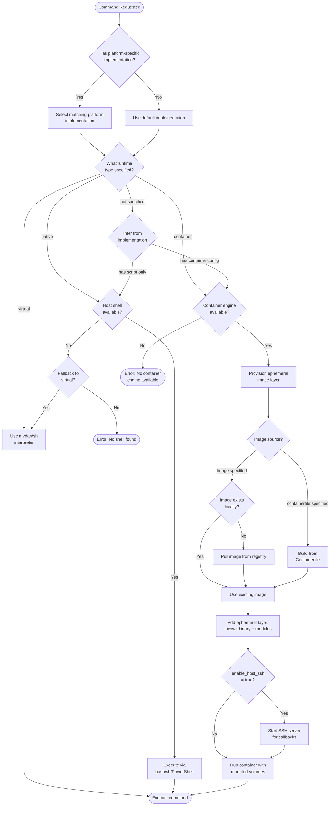
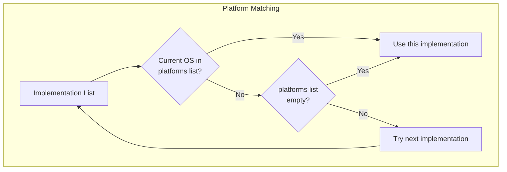
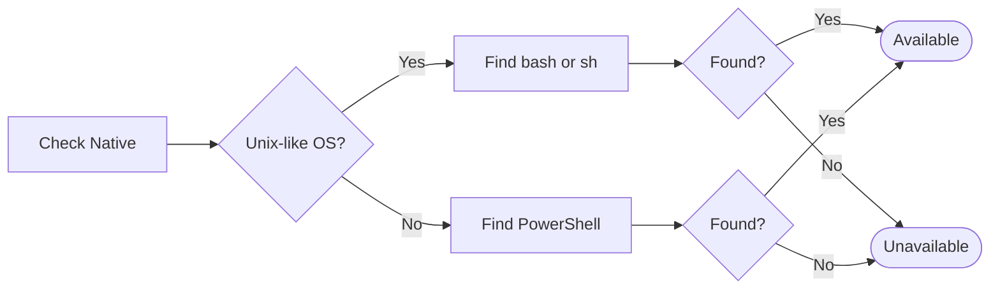
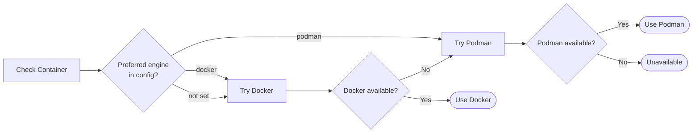
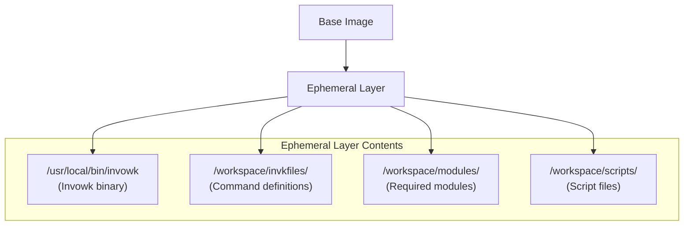
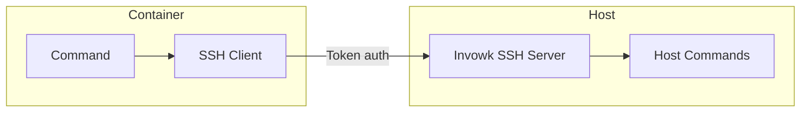

# Runtime Selection Flowchart

This diagram documents the decision tree for selecting which runtime executes a command. Understanding this helps users choose the right runtime for their use case.

## Decision Flowchart



## Platform Selection Details



### Platform Values

| Platform Value | Matches On |
|---------------|------------|
| `"linux"` | Linux systems |
| `"darwin"` | macOS systems |
| `"windows"` | Windows systems |
| (empty list) | All platforms (default) |

### Example Command Definition

```cue
cmds: {
    build: {
        default: {
            runtime: "native"
            script: "make build"
        }
        implementations: [
            {
                platforms: ["windows"]
                runtime: "native"
                script: "nmake build"
            },
            {
                platforms: ["linux"]
                runtime: "container"
                container: {
                    image: "golang:1.21"
                }
                script: "make build"
            }
        ]
    }
}
```

## Runtime Comparison

| Aspect | Native | Virtual | Container |
|--------|--------|---------|-----------|
| **Speed** | Fastest | Fast | Slower (overhead) |
| **Isolation** | None | Process | Full |
| **Portability** | Platform-dependent | High | Highest |
| **Shell features** | Full host shell | POSIX subset | Full (in container) |
| **Dependencies** | Host shell | None | Docker/Podman |
| **Best for** | Simple scripts | Cross-platform | Complex environments |

## Runtime Availability Checks

### Native Runtime



### Virtual Runtime


The virtual runtime is always available because it's embedded in the Invowk binary.

### Container Runtime



## Container Provisioning Details

When the container runtime is selected, Invowk creates an ephemeral image layer:



### Why Ephemeral Layers?

1. **No image pollution**: Base images stay clean
2. **Fast iteration**: No full rebuild needed
3. **Portable**: Commands work with any compatible base image
4. **Secure**: Invowk binary is injected, not installed in image

## SSH Server for Callbacks

When `enable_host_ssh: true` is set, Invowk starts a temporary SSH server:



**Use cases:**
- Accessing host secrets
- Running host-only commands
- File synchronization

## Decision Guidelines

| Use Case | Recommended Runtime | Why |
|----------|-------------------|-----|
| Quick scripts | `native` | Fastest, no overhead |
| Cross-platform commands | `virtual` | Works everywhere |
| CI/CD pipelines | `container` | Reproducible |
| Commands needing specific tools | `container` | Isolated dependencies |
| Interactive TUI | `native` or `virtual` | Better terminal support |

## Related Diagrams

- [Command Execution Sequence](./sequence-execution.md) - Full execution flow
- [C4 Container Diagram](./c4-container.md) - Runtime component relationships
- [Discovery Precedence Flowchart](./flowchart-discovery.md) - How commands are found
