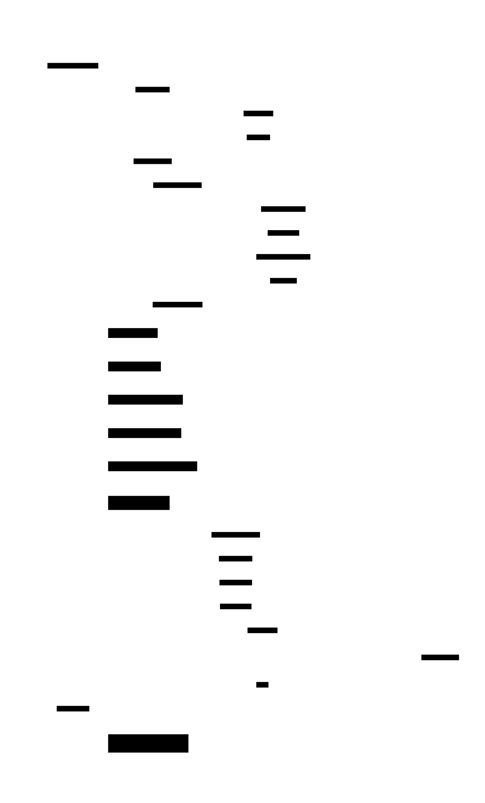
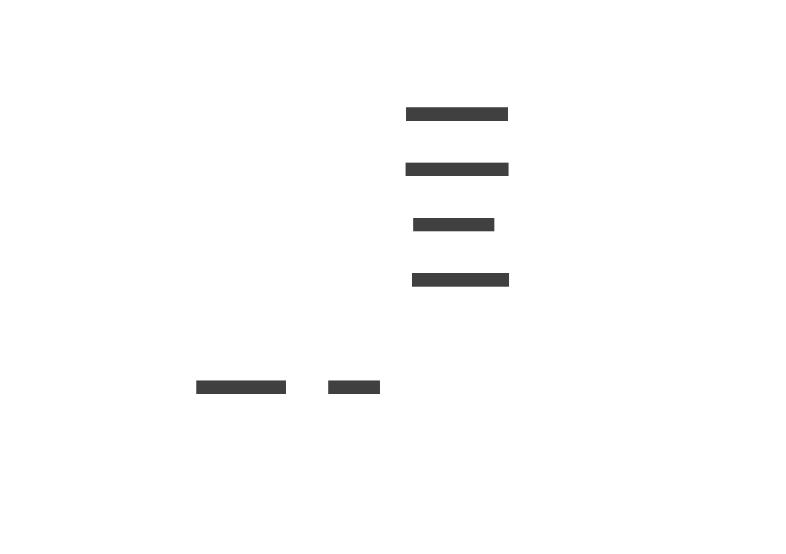

# Command Execution Sequence Diagram

This diagram shows the temporal flow from CLI invocation through discovery, runtime selection, and execution. Understanding this flow helps with debugging and extending Invowk.

## Main Execution Flow

## Container Runtime Flow (Detailed)

When the container runtime is selected, additional steps occur:

## Virtual Runtime Flow

The virtual runtime uses the embedded mvdan/sh interpreter:

## Phase Descriptions

### 1. Initialization Phase

| Step | Component | Action |
|------|-----------|--------|
| 1 | CLI | Receive user command |
| 2-4 | Config + CUE | Load and parse `~/.config/invowk/config.cue` |

**Key decisions made:**
- Container engine preference (docker vs podman)
- Search paths for invkfiles/modules
- Default runtime if not specified

### 2. Discovery Phase

| Step | Component | Action |
|------|-----------|--------|
| 5 | Discovery | Start command discovery |
| 6-7 | CUE Parser | Parse all `invkfile.cue` files |
| 8-9 | CUE Parser | Parse all `*.invkmod` directories |
| 10 | Discovery | Build unified command tree |

**Precedence order (highest to lowest):**
1. Current directory `invkfile.cue`
2. Current directory `*.invkmod`
3. User directory `~/.invowk/cmds/`
4. Configured search paths

### 3. Resolution Phase

| Step | Component | Action |
|------|-----------|--------|
| 11 | CLI | Match command name to discovered commands |
| 12 | CLI | Select platform-specific implementation |
| 13-14 | Registry | Get appropriate runtime instance |
| 15-16 | Runtime | Validate execution context |

**Platform matching:**
- Check for `platforms: ["linux"]`, `["darwin"]`, `["windows"]`
- Fall back to default implementation if no platform match

### 4. Execution Phase

| Step | Component | Action |
|------|-----------|--------|
| 17 | Runtime | Begin execution |
| 18-19 | Executor | Run the actual script/command |
| 20 | Runtime | Return result |
| 21 | CLI | Output to user |

**Runtime-specific behavior:**
- **Native**: Spawns host shell process
- **Virtual**: Interprets via mvdan/sh
- **Container**: Provisions image, runs container

## Error Handling Points

## Performance Considerations

| Phase | Typical Duration | Optimization |
|-------|------------------|--------------|
| Initialization | < 10ms | Config cached after first load |
| Discovery | 10-100ms | Depends on number of files/modules |
| Resolution | < 1ms | Simple lookup |
| Execution | Variable | Depends on command |

**Bottlenecks to watch:**
- Many modules in search paths → slower discovery
- Large invkfiles → slower parsing
- Container image pulls → can be minutes

## Related Diagrams

- [C4 Container Diagram](./c4-container.md) - Component relationships
- [Runtime Selection Flowchart](./flowchart-runtime-selection.md) - How runtimes are chosen
- [Discovery Precedence Flowchart](./flowchart-discovery.md) - How commands are discovered
