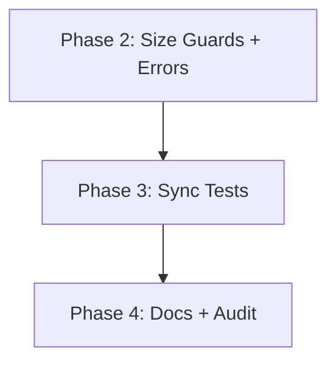

# Implementation Plan: CUE Library Usage Optimization

**Branch**: `004-cue-lib-optimization` | **Date**: 2026-01-30 | **Spec**: [spec.md](./spec.md)
**Input**: Feature specification from `/specs/004-cue-lib-optimization/spec.md`

## Summary

Optimize Invowk's CUE library usage to be idiomatic, type-safe, and maintainable. Based on [research findings](./research.md), the approach is:

1. **Do NOT generate Go structs from CUE** - Add schema sync tests instead
2. **Add file size guards** - Reject oversized files before parsing
3. **Consolidate validation** - Remove redundant Go checks, document exceptions
4. **Expand documentation** - Comprehensive `.claude/rules/cue.md`
5. **Improve error messages** - Ensure JSON path prefixes in all CUE errors

**Key Decision Change**: Research showed that CUE code generation is not production-ready. Schema sync tests achieve the same goal (catching mismatches) with simpler tooling.

## Technical Context

**Language/Version**: Go 1.25+
**Primary Dependencies**: `cuelang.org/go v0.15.3`, `github.com/spf13/cobra`, `github.com/spf13/viper`
**Storage**: File-based (CUE configuration files)
**Testing**: `testing` package with table-driven tests, `testscript` for CLI
**Target Platform**: Linux, macOS, Windows (cross-platform CLI)
**Project Type**: Single CLI tool
**Performance Goals**: <100ms startup time for `invowk --help`
**Constraints**: Single binary distribution, no runtime code generation
**Scale/Scope**: ~15 Go files currently use CUE-decoded structs

## Constitution Check

*GATE: Must pass before Phase 0 research. Re-check after Phase 1 design.*

| Principle | Status | Notes |
|-----------|--------|-------|
| I. Idiomatic Go & Schema-Driven Design | ✅ PASS | Feature specifically improves CUE schema patterns |
| II. Comprehensive Testing Discipline | ✅ PASS | Schema sync tests will be added |
| III. Consistent User Experience | N/A | Internal refactoring, no user-facing changes |
| IV. Single-Binary Performance | ✅ PASS | No runtime code generation; simple file size check |
| V. Simplicity & Minimalism | ✅ PASS | Sync tests are simpler than code generation |
| VI. Documentation Synchronization | ✅ PASS | Rules file update is part of requirements |
| VII. Pre-Existing Issue Resolution | ✅ PASS | Config schema unused issue will be addressed |

## Project Structure

### Documentation (this feature)

```text
specs/004-cue-lib-optimization/
├── plan.md              # This file
├── research.md          # Research findings (complete)
├── quickstart.md        # Implementation guide (complete)
└── tasks.md             # Phase 2 output (/speckit.tasks command)
```

### Source Code (repository root)

```text
pkg/
├── invkfile/
│   ├── invkfile_schema.cue      # Source of truth (unchanged)
│   ├── parse.go                 # Modified: file size check, error formatting
│   ├── sync_test.go             # NEW: Schema-struct sync verification
│   └── invkfile_validation.go   # Modified: audit redundant checks
├── invkmod/
│   ├── invkmod_schema.cue       # Source of truth (unchanged)
│   ├── invkmod.go               # Modified: file size check, error formatting
│   └── sync_test.go             # NEW: Schema-struct sync verification

internal/
├── config/
│   ├── config_schema.cue        # Source of truth (unchanged)
│   ├── config.go                # Modified: add schema validation
│   └── sync_test.go             # NEW: Schema-struct sync verification

.claude/rules/
└── cue.md                       # UPDATED: Comprehensive CUE patterns guide
```

**Structure Decision**: No new packages needed. Sync tests live alongside existing code. This is the simplest approach.

## Complexity Tracking

> **No Constitution violations to justify** - Research led to simpler approach than initially proposed.

---

## Phase 0: Research (Complete)

See [research.md](./research.md) for full findings. Key decisions:

| Topic | Decision |
|-------|----------|
| Struct generation | **Do NOT generate** - sync tests instead |
| Context reuse | Package-level singleton via `sync.Once` (optional) |
| Tagged unions | Current `name` discriminator pattern sufficient |
| Error paths | Format via `cue/errors` path extraction |
| File size limit | 5MB default, check before CUE parsing |
| Version management | Pin + documented upgrade checklist |
| Validation redundancy | Audit in Phase 2; most is correctly CUE-only |

---

## Phase 1: Design (Complete)

### 1.1 Schema Sync Test Strategy

**Approach**: Reflection-based comparison at test time.

The sync test extracts field names from both CUE schemas and Go structs, then compares:

```go
func TestInvkfileFieldSync(t *testing.T) {
    ctx := cuecontext.New()
    schema := ctx.CompileString(invkfileSchema)
    invkfileDef := schema.LookupPath(cue.ParsePath("#Invkfile"))

    // Get CUE field names
    cueFields := extractCUEFields(invkfileDef)

    // Get Go struct JSON tags
    goFields := extractGoJSONTags(reflect.TypeOf(Invkfile{}))

    // Compare (with exclusion list for runtime-only fields)
    for _, field := range cueFields {
        if !goFields[field] && !isExcluded(field) {
            t.Errorf("CUE field %q not found in Go struct tags", field)
        }
    }
}
```

**Benefits**:
1. No code generation tooling
2. Catches mismatches at CI time
3. Simple to maintain

### 1.2 File Size Guard

**Implementation Location**: Early in parse functions.

```go
const DefaultMaxCUEFileSize = 5 * 1024 * 1024 // 5MB

func ParseBytes(data []byte, path string) (*Invkfile, error) {
    if len(data) > DefaultMaxCUEFileSize {
        return nil, fmt.Errorf("invkfile at %s exceeds maximum size (%d bytes, limit %d)",
            path, len(data), DefaultMaxCUEFileSize)
    }
    // ... existing parsing ...
}
```

### 1.3 Error Path Formatting

**Wrapper function for consistent error output**:

```go
import "cuelang.org/go/cue/errors"

func formatCUEError(err error, filePath string) error {
    var lines []string
    for _, e := range errors.Errors(err) {
        pathStr := formatPath(e.Path())
        if pathStr != "" {
            lines = append(lines, fmt.Sprintf("%s: %s", pathStr, e.Error()))
        } else {
            lines = append(lines, e.Error())
        }
    }
    if len(lines) == 1 {
        return fmt.Errorf("%s: %s", filePath, lines[0])
    }
    return fmt.Errorf("%s: validation failed:\n  %s", filePath, strings.Join(lines, "\n  "))
}
```

### 1.4 Config Schema Validation

**Pre-existing Issue Found**: The `config_schema.cue` file exists but is never used for validation in `internal/config/config.go`. The `loadCUEIntoViper` function parses CUE but doesn't validate against the schema.

**Fix**: Add schema validation to config loading.

### 1.5 Validation Responsibility Matrix

| Validation Type | Where | Rationale |
|-----------------|-------|-----------|
| Field format (regex) | CUE | Schema is source of truth |
| Enum values | CUE | Compile-time validation |
| Length limits | CUE | `strings.MaxRunes()` |
| Path traversal | CUE | `!strings.Contains("..")` |
| ReDoS safety | Go | CUE can't analyze regex complexity |
| Runtime-specific fields | Go | Cross-field logic (e.g., interpreter + runtime type) |
| File existence | Go | Filesystem access |
| Post-decode defaults | Go | Business logic |

---

## Phases 2-4: Implementation Tasks

Phases are designed to fit within a single context window each (~4k tokens of changes).

### Phase 2: File Size Guards + Error Formatting

**Scope**: ~80 lines of modifications

| Task | Description | Files |
|------|-------------|-------|
| 2.1 | Add `DefaultMaxCUEFileSize` constant and size check to `pkg/invkfile/parse.go` | parse.go |
| 2.2 | Add size check to `pkg/invkmod/invkmod.go:ParseInvkmodBytes` | invkmod.go |
| 2.3 | Add `formatCUEError` helper with path extraction | parse.go, invkmod.go |
| 2.4 | Update error messages to use formatter | parse.go, invkmod.go |

**Exit Criteria**: `make test` passes, errors include JSON paths

### Phase 3: Schema Sync Tests

**Scope**: ~150 lines of new test code

| Task | Description | Files |
|------|-------------|-------|
| 3.1 | Create `extractCUEFields` and `extractGoJSONTags` helpers | pkg/invkfile/sync_test.go |
| 3.2 | Add sync test for `Invkfile` struct | pkg/invkfile/sync_test.go |
| 3.3 | Add sync test for `Command`, `Implementation`, etc. | pkg/invkfile/sync_test.go |
| 3.4 | Add sync test for `Invkmod` struct | pkg/invkmod/sync_test.go |
| 3.5 | Add sync test for `Config` struct | internal/config/sync_test.go |
| 3.6 | Add config schema validation to `loadCUEIntoViper` | internal/config/config.go |

**Exit Criteria**: All sync tests pass, mismatches would cause test failure

### Phase 4: Documentation + Validation Audit

**Scope**: ~100 lines of documentation, ~20 lines of code changes

| Task | Description | Files |
|------|-------------|-------|
| 4.1 | Expand `.claude/rules/cue.md` with comprehensive patterns | cue.md |
| 4.2 | Document CUE library upgrade process | cue.md |
| 4.3 | Audit Go validation for redundancy | invkfile_validation.go |
| 4.4 | Add justification comments for Go-only validation | Various |
| 4.5 | Final review against spec acceptance criteria | N/A |

**Exit Criteria**: All SC-* success criteria verified, rules file complete

---

## Dependencies



Linear dependency: each phase builds on the previous.

## Risk Mitigation

| Risk | Mitigation |
|------|------------|
| Sync test too strict | Exclusion list for runtime-only fields (e.g., `FilePath`) |
| CUE error path extraction fails | Fallback to raw error message |
| Config schema mismatch | Fix mismatch during Phase 3 |

## Success Verification

| Success Criterion | Verification Method |
|-------------------|---------------------|
| SC-001: 100% generated structs | **Revised**: Sync tests verify all struct fields match CUE schema |
| SC-002: Zero redundant validation | Audit complete, documented exceptions |
| SC-003: Manual extraction justified | No manual extraction found in current code |
| SC-004: Rules file complete | 5 key patterns documented |
| SC-005: Zero CUE warnings | `make lint` + `go vet` clean |
| SC-006: Contributor clarity | Review rules file for standalone comprehension |

---

## Revision History

| Date | Change |
|------|--------|
| 2026-01-30 | Initial plan with code generation approach |
| 2026-01-30 | Revised after research: sync tests instead of code generation |
